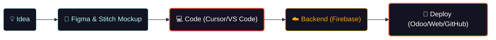

# Syed Affan Saeed

<p align="center">
  <a href="https://git.io/typing-svg">
    
  </a>
</p>

<p align="center">
  <strong>Software Engineer | ERP Developer | Constructing Practical &amp; High-Performance Web Solutions</strong>
</p>

<p align="center">
  
</p>

---

## 📟 Terminal Profile

```bash
$ paid-dev-from-pak --init
> Loading profile metadata... [████████████████████] 100%

• Name:    Syed Affan Saeed
• Role:    Software Engineer & Front-End Developer
• Focus:   HTML, CSS, JS, Java, Python, Firebase, Figma, Stitch, Odoo
• Stack:   Driven by Cursor, VS Code, GitHub & Google Antigravity AI
• Home:    Pakistan 🇵🇰
```

---

## 👨‍💻 About Me

<table width="100%">
  <tr>
    <td width="55%" valign="top">
      <h3>🚀 Quick Overview</h3>
      <ul>
        <li>💻 Specialized in <strong>Front-End Web Development</strong>, building responsive, user-centric web applications.</li>
        <li>💼 Actively working with <strong>Odoo ERP</strong>, developing and customizing business modules.</li>
        <li>⚡ Experienced in programming with <strong>Java and Python</strong> to build robust application logic.</li>
        <li>🌱 Passionate about adopting bleeding-edge developer tools to ship code faster and cleaner.</li>
      </ul>
    </td>
    <td width="45%" valign="top">
      <h3>🌱 Current Focus & Tech Interests</h3>
      <ul>
        <li>💼 Customizing workflows and views in <strong>Odoo ERP</strong>.</li>
        <li>🤖 Optimizing development speed with AI integrations (<strong>Cursor &amp; Antigravity</strong>).</li>
        <li>☁️ Structuring backend systems using <strong>Firebase</strong>.</li>
        <li>🎨 Prototyping layouts in <strong>Figma &amp; Stitch</strong> to build modern interfaces.</li>
      </ul>
    </td>
  </tr>
</table>

---

## 🛠 Tech Stack & Tools

<table width="100%">
  <tr>
    <td valign="top" width="50%">
      <h4>🌐 Front-End Development</h4>
      
    </td>
    <td valign="top" width="50%">
      <h4>⚙️ Back-End & Cloud</h4>
      
    </td>
  </tr>
  <tr>
    <td valign="top" width="50%">
      <h4>💼 Enterprise & ERP Systems</h4>
      
      
    </td>
    <td valign="top" width="50%">
      <h4>💻 Core Languages</h4>
      
    </td>
  </tr>
  <tr>
    <td valign="top" width="50%">
      <h4>🎨 UI/UX Design & Prototyping</h4>
      
      
    </td>
    <td valign="top" width="50%">
      <h4>🛠️ Toolchain & AI Editors</h4>
      
      <br/>
      
      
    </td>
  </tr>
</table>

---

## 🗺️ Developer Skill Tree

Here is a visual map of my software engineering capabilities and learning trajectory:

```mermaid
graph TD
    %% Node definitions with icons/emojis
    User("👤 Syed Affan Saeed")
    FE("🎨 Front-End & Design")
    SE("💻 Logic & Back-End")
    ERP("⚙️ Enterprise & ERP Systems")
    Tools("🔧 Developer Tools & IDEs")
    
    FE --> Web("🌐 HTML / CSS / JS")
    FE --> Design("📐 Figma & Stitch")
    
    SE --> Languages("☕ Java & Python")
    SE --> Backend("☁️ Firebase Cloud")
    
    ERP --> Odoo("💼 Odoo Customization")
    ERP --> BizLogic("⚙️ Python Automation")
    
    Tools --> IDEs("💻 VS Code & Cursor")
    Tools --> Git("🐙 GitHub")
    Tools --> AG("🚀 Google Antigravity")

    %% Theme / Styling matching Radical Accent
    style User fill:#FE532A,stroke:#FE532A,stroke-width:2px,color:#ffffff;
    style FE fill:#141321,stroke:#FE532A,stroke-width:2px,color:#ffffff;
    style SE fill:#141321,stroke:#FE532A,stroke-width:2px,color:#ffffff;
    style ERP fill:#141321,stroke:#FE532A,stroke-width:2px,color:#ffffff;
    style Tools fill:#141321,stroke:#FE532A,stroke-width:2px,color:#ffffff;
    
    style Web fill:#141321,stroke:#a9fef7,stroke-width:1px,color:#a9fef7;
    style Design fill:#141321,stroke:#a9fef7,stroke-width:1px,color:#a9fef7;
    
    style Languages fill:#141321,stroke:#f8a307,stroke-width:1px,color:#f8a307;
    style Backend fill:#141321,stroke:#f8a307,stroke-width:1px,color:#f8a307;
    
    style Odoo fill:#141321,stroke:#f8a307,stroke-width:1px,color:#f8a307;
    style BizLogic fill:#141321,stroke:#f8a307,stroke-width:1px,color:#f8a307;
    
    style IDEs fill:#141321,stroke:#a9fef7,stroke-width:1px,color:#a9fef7;
    style Git fill:#141321,stroke:#a9fef7,stroke-width:1px,color:#a9fef7;
    style AG fill:#141321,stroke:#fe532a,stroke-width:1.5px,color:#ffffff;
```



---

## ⚡ Development Workflow

This is how I translate concepts into production-ready software:



---

## 🚀 Featured Projects

<table width="100%">
  <tr>
    <td width="50%" valign="top">
      <h4>☁️ Cloud-Vault</h4>
      <p>A secure, Firebase-backed personal cloud storage application featuring Google Authentication, category-based file organization, and an intuitive dashboard.</p>
      <p>
        
      </p>
    </td>
    <td width="50%" valign="top">
      <h4>🤖 AI Attendance System</h4>
      <p>An automated attendance tracking system using AI and facial recognition technology to streamline academic and workplace check-ins.</p>
      <p>
        
      </p>
    </td>
  </tr>
  <tr>
    <td width="50%" valign="top">
      <h4>🏋️ Gym Landing Page</h4>
      <p>A fully responsive, modern web interface for a fitness center. Designed from scratch with clean typography and smooth visual layouts.</p>
      <p>
        
      </p>
    </td>
    <td width="50%" valign="top">
      <h4>🛒 E-Commerce storefront</h4>
      <p>A sleek, mobile-friendly e-commerce landing page optimized for fluid browsing experiences across all device sizes.</p>
      <p>
        
      </p>
    </td>
  </tr>
</table>

---

## 📊 GitHub Analytics

<p align="center">
  
  
</p>

<p align="center">
  
</p>

---

## 🏆 GitHub Trophies

<p align="center">
  
</p>

---

## 📈 Contribution Graph & Activity Snake

<p align="center">
  
</p>

<p align="center">
  <picture>
    <source media="(prefers-color-scheme: dark)" srcset="https://raw.githubusercontent.com/Paid-Dev-From-Pak/Paid-Dev-From-Pak/output/github-contribution-grid-snake-dark.svg">
    <source media="(prefers-color-scheme: light)" srcset="https://raw.githubusercontent.com/Paid-Dev-From-Pak/Paid-Dev-From-Pak/output/github-contribution-grid-snake.svg">
    
  </picture>
</p>

---

## 💡 Random Dev Quote

<p align="center">
  
</p>

---

## 🌐 Connect With Me

<div align="center" style="display: flex; justify-content: center; gap: 15px; flex-wrap: wrap; width: 100%;">
  <a href="mailto:syedaffansaeed051051@gmail.com">
    
  </a>
  <a href="https://github.com/Paid-Dev-From-Pak">
    
  </a>
</div>

---

<div align="center">
  <h3>⭐ Thank you for stopping by!</h3>
  <p><strong>Code • Learn • Build • Repeat 🚀</strong></p>
</div>
